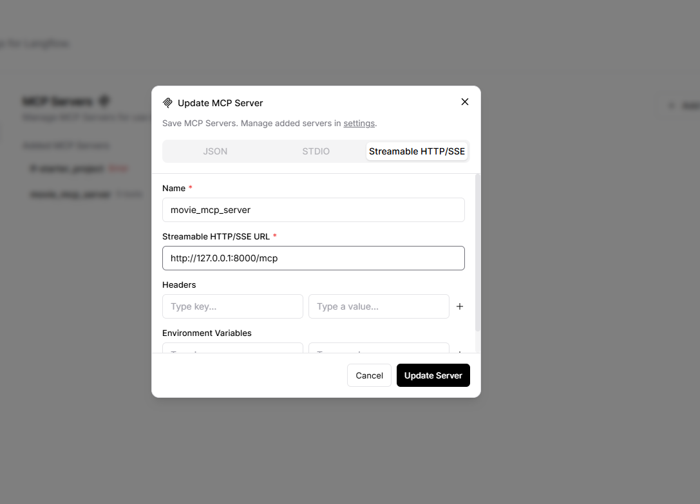
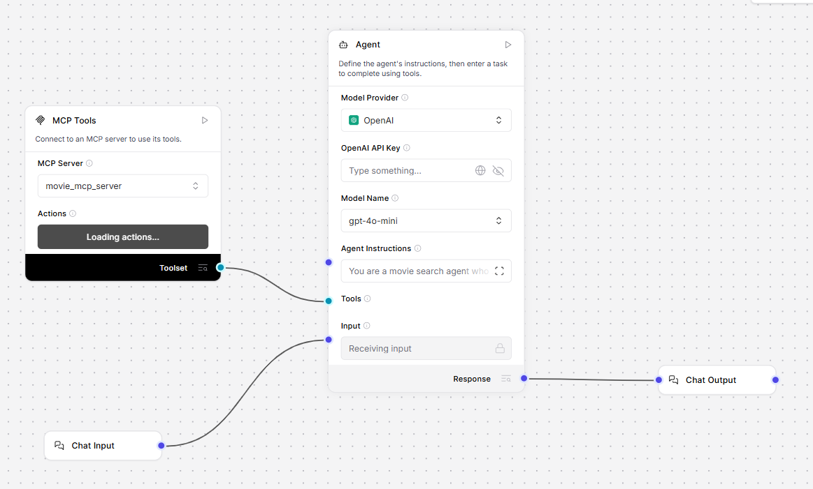

# Demo for using Langflow eith custom MCP server

This project includes a sample implementation of how to integrate your own MCP server with the Langflow.

## Setup

Clone the repository to get the implementation of a custom MCP server that handles operations related to movies and screenings.

### Setup Langflow

The installation steps of Langflow can be find on this [website](https://docs.langflow.org/get-started-installation).

### Setup MCP server

Run this command in the root folder of the project:

```bash
pip install -r requirements.txt
```

Then navigate into `src` folder and start the MCP server with:

```bash
python main.py
```

Once the MCP server has started, the following message should appear on the console:

```bash
INFO:     Started server process [...]
INFO:     Waiting for application startup.
INFO:     Application startup complete.
INFO:     Uvicorn running on http://127.0.0.1:8000
```

## Connect Langflow with MCP server

After Langflow was started, you have to set the details of MCP server in the `Settings/MCP servers`.



Then create a simple agent flow and add a `MCP tools` component to it:



You can find the exported flow in the `data` folder.
